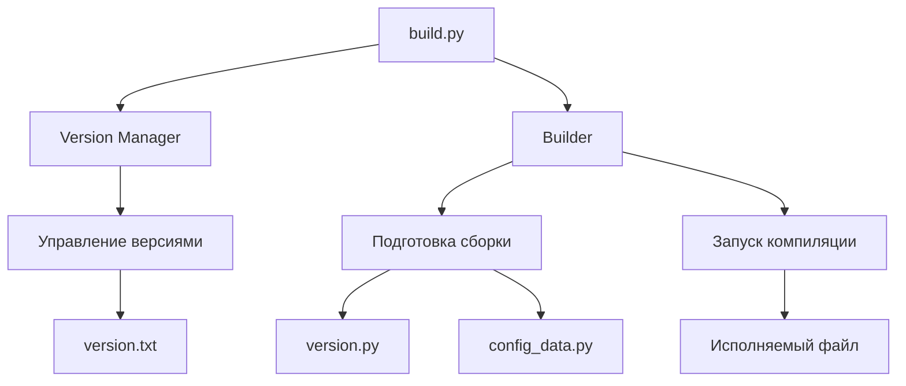

# Universal Build System (UBS)

Универсальная система сборки для мультиязычных проектов с поддержкой семантического версионирования и автоматической генерацией конфигурационных файлов.

## 🌟 Почему этот проект особенный?

- ⚡ **Экономит часы настройки** для каждого нового проекта
- 🌍 **Поддерживает несколько языков** из коробки: Python, C++, Rust, Go
- 🔄 **Автоматизирует управление версиями** по принципам Semantic Versioning
- 🧩 **Легко расширяется** под любые инструменты сборки
- 📦 **Создает воспроизводимые билды** с встроенными метаданными

## 🚀 Быстрый старт

### Установка
```bash
git clone https://github.com/whoiamHiragana/universal-build-system.git
cd universal-build-system
```

### Базовая настройка
1. Откройте файл `build.py`
2. Найдите секцию `CONFIG` и настройте параметры под свой проект:

```python
CONFIG = {
    "APP_NAME": "MyAwesomeApp",
    "MAIN_SCRIPT": "src/main.py",
    "LANGUAGE": "python",
    # ... остальные параметры
}
```

### Использование
```bash
# Сборка с увеличением минорной версии
python build.py --minor

# Сборка с установкой конкретной версии
python build.py --set-version 2.0.0

# Простая сборка без изменения версии
python build.py
```

## 🛠 Детальная настройка

### Основные параметры

| Параметр      | Описание                                  | По умолчанию     |
|---------------|-------------------------------------------|------------------|
| APP_NAME      | Название приложения                       | "MyApp"         |
| MAIN_SCRIPT   | Главный файл для сборки                   | "main.py"       |
| ICON_FILE     | Путь к иконке (для GUI)                   | None             |
| VERSION_FILE  | Файл хранения версии                     | "version.txt"   |
| BUILD_DIR     | Директория временных файлов              | "build"         |
| DIST_DIR      | Директория выходных файлов               | "dist"          |
| LANGUAGE      | Язык программирования                    | "python"        |

### Поддерживаемые языки и команды
```python
BUILD_COMMAND = {
    "python": [
        "pyinstaller", "--onefile", "--name", "{exe_name}",
        "--distpath", "{dist_dir}", "--workpath", "{build_dir}",
        "--console", "{main_script}"
    ],
    "cpp": ["g++", "{main_script}", "-o", "{exe_name}"],
    "rust": ["cargo", "build", "--release"],
    "go": ["go", "build", "-o", "{exe_name}"]
}
```

### Метаданные проекта
```python
"AUTHOR": "Your Name",
"DESCRIPTION": "App Description",
"COMPANY": "Your Company",
"COPYRIGHT": "Copyright © 2025",
```

### Расширенные опции
```python
"AUTO_VERSION_MODULE": True,   # Генерировать version.py
"AUTO_CONFIG_MODULE": True,    # Генерировать config_data.py
```

## 🔍 Как это работает?



## 🚩 Ключевые компоненты

### Version Manager

- Автоматически создает/читает `version.txt`
- Поддерживает команды:
  - `--major` - мажорное обновление (X+1.0.0)
  - `--minor` - минорное обновление (X.Y+1)
  - `--patch` - патч-обновление (X.Y.Z+1)
  - `--set-version` - установка кастомной версии

### Builder

- Генерирует конфигурационные файлы:
  - `version.py` с текущей версией
  - `config_data.py` с метаданными проекта
- Запускает команды сборки в зависимости от языка
- Автоматически создает рабочие директории

### Конфигурационная система

- Централизованный словарь `CONFIG`
- Подстановка переменных:
  - `{exe_name}` - имя исполняемого файла
  - `{version}` - текущая версия
  - `{build_dir}` - путь к директории сборки

## 🌐 Примеры использования

### Для Python-проекта
```python
CONFIG = {
    "APP_NAME": "DataProcessor",
    "MAIN_SCRIPT": "app/main.py",
    "ICON_FILE": "assets/icon.ico",
    "LANGUAGE": "python",
    "AUTHOR": "Data Team",
    "DESCRIPTION": "Advanced data processing toolkit"
}
```

### Для C++ проекта
```python
CONFIG = {
    "APP_NAME": "ImageRenderer",
    "MAIN_SCRIPT": "src/main.cpp",
    "LANGUAGE": "cpp",
    "BUILD_COMMAND": {
        "cpp": ["g++", "{main_script}", "-O2", "-o", "{exe_name}"]
    }
}
```

### Для Rust проекта
```python
CONFIG = {
    "APP_NAME": "NetworkMonitor",
    "LANGUAGE": "rust",
    "AUTO_VERSION_MODULE": False,
    "BUILD_COMMAND": {
        "rust": ["cargo", "build", "--release", "--target-dir", "{build_dir}"]
    }
}
```

## 🚨 Ограничения и устранение неполадок

### Распространенные ошибки

- **Язык не поддерживается:**
  ```bash
  ValueError: Unsupported language: javascript
  ```
  **Решение:** Добавьте команду сборки в `BUILD_COMMAND`

- **Некорректная версия:**
  ```bash
  ValueError: Invalid version format
  ```
  **Решение:** Используйте формат `X.Y.Z` (например, `1.2.3`)

- **Отсутствуют зависимости:**
  ```bash
  ModuleNotFoundError: No module named 'PyInstaller'
  ```
  **Решение:** Система автоматически установит PyInstaller для Python-проектов

### Советы по производительности

- Для больших проектов отключите генерацию модулей:
  ```python
  "AUTO_VERSION_MODULE": False,
  "AUTO_CONFIG_MODULE": False
  ```
- Используйте `.gitignore` для временных файлов:
  ```text
  build/
  dist/
  *.spec
  ```

## 📜 Лицензия

Этот проект распространяется под лицензией MIT. Подробнее см. в файле `LICENSE`.

---

Universal Build System © 2023 - создано с ❤️ для разработчиков.
Если у вас есть вопросы или предложения, создавайте issue в репозитории!
